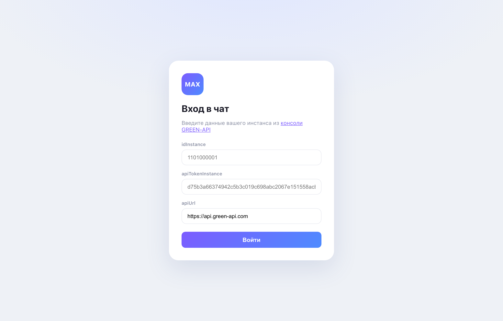
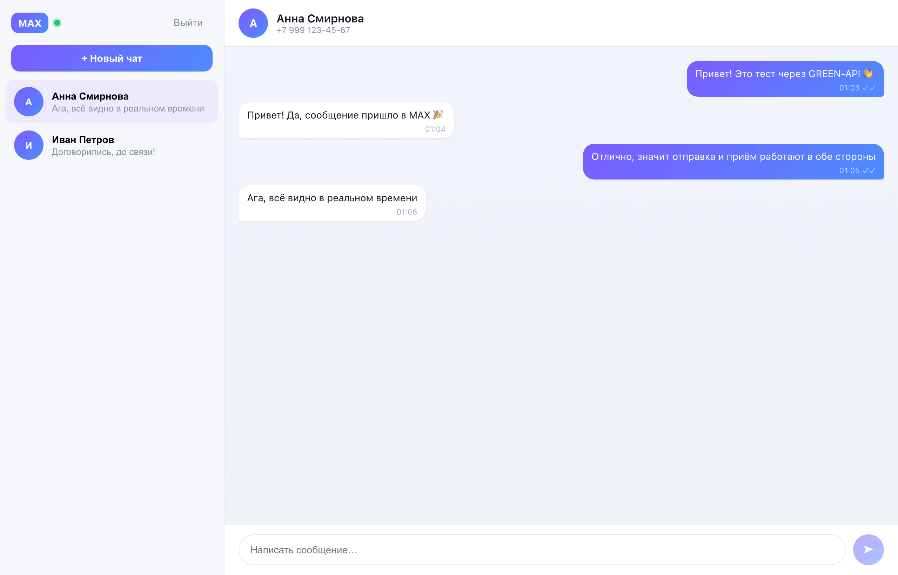
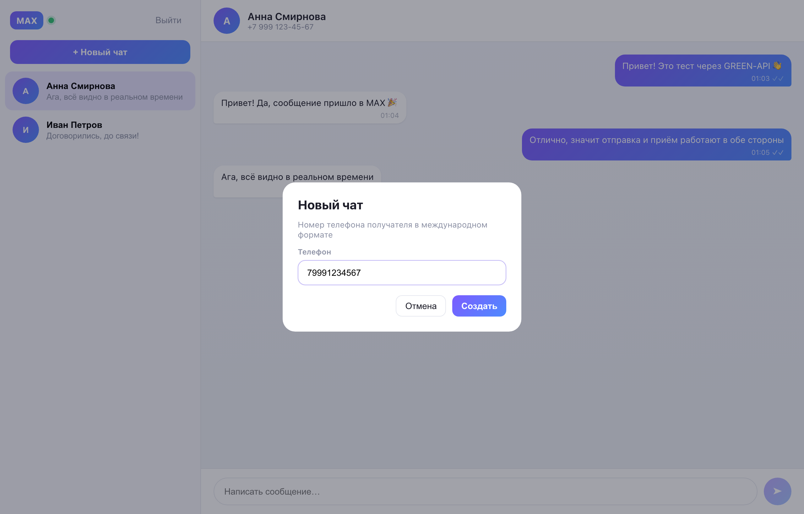

# MAX Chat · GREEN-API

Минимальный веб-интерфейс чата на **React + TypeScript** для отправки и получения
**текстовых** сообщений через [GREEN-API](https://green-api.com/max) (мессенджер **MAX**).
Внешний вид чата вдохновлён [web.max.ru](https://web.max.ru/).

> Тестовое задание на должность «Фронтенд разработчик React».

## Скриншоты

| Вход | Диалог | Новый чат |
|------|--------|-----------|
|  |  |  |

## Возможности

- Вход по данным инстанса GREEN-API (`idInstance`, `apiTokenInstance`, `apiUrl`).
- Проверка авторизации инстанса перед входом (`getStateInstance`).
- Создание нового чата по номеру телефона получателя.
- Отправка текстовых сообщений — метод [`SendMessage`](https://green-api.com/v3/docs/api/sending/SendMessage/).
- Получение входящих сообщений — [HTTP API polling](https://green-api.com/v3/docs/api/receiving/technology-http-api/)
  (`receiveNotification` → обработка → `deleteNotification`).
- Статусы доставки исходящих сообщений (отправлено / доставлено / прочитано).
- MAX-подобный интерфейс: список чатов, «пузыри» сообщений, поле ввода.
- Данные и переписка сохраняются в `localStorage` и переживают перезагрузку.

## Стек

- React 18 + TypeScript
- Vite 5
- Прямые вызовы GREEN-API из браузера (CORS поддерживается — бэкенд не нужен)

## Как это работает

```
┌────────────┐   sendMessage (POST)         ┌────────────┐
│            │ ───────────────────────────► │            │
│  Браузер   │                              │ GREEN-API  │ ──► MAX
│  (React)   │ ◄─────────────────────────── │            │ ◄── MAX
└────────────┘   receiveNotification (GET)  └────────────┘
                 deleteNotification (DELETE)
```

Приложение циклически опрашивает `receiveNotification`. Как только приходит
уведомление `incomingMessageReceived`, текст добавляется в соответствующий чат,
а уведомление подтверждается через `deleteNotification`, чтобы не приходить повторно.

## Локальный запуск

Требуется **Node.js 18+**.

```bash
# 1. Установить зависимости
npm install

# 2. Запустить дев-сервер
npm run dev
# → http://localhost:5173

# 3. Продакшн-сборка (опционально)
npm run build
npm run preview
```

## Как пользоваться

1. Зарегистрируйтесь в [консоли GREEN-API](https://console.green-api.com/) и создайте
   инстанс для **MAX**. Авторизуйте его согласно инструкции сервиса.
2. Убедитесь, что для инстанса включён режим получения уведомлений (HTTP API).
   В настройках инстанса (`SetSettings`) параметр `webhookUrl` должен быть пустым, а
   `incomingWebhook` / `outgoingWebhook` / `stateWebhook` — `yes`.
3. Откройте приложение, введите `idInstance` и `apiTokenInstance` (при необходимости
   измените `apiUrl`) и нажмите **Войти**.
4. Нажмите **+ Новый чат**, введите номер телефона получателя (в международном
   формате, например `79991234567`) и создайте чат.
5. Напишите сообщение и отправьте его. Ответы получателя из MAX появятся в чате
   автоматически.

## Переменные и настройки

- `apiUrl` по умолчанию — `https://api.green-api.com` (можно изменить на экране входа,
  если ваш инстанс использует другой хост).
- `BASE_PATH` (env при сборке) — базовый путь для хостинга в подкаталоге
  (например, GitHub Pages): `BASE_PATH=/green-api-max-chat/ npm run build`.

## Структура проекта

```
src/
  api/greenApi.ts       — обёртки над HTTP-методами GREEN-API
  hooks/usePolling.ts   — цикл опроса входящих уведомлений
  components/           — LoginForm, Sidebar, ChatWindow, NewChatDialog
  utils/                — storage (localStorage), format (телефон/время)
  App.tsx               — состояние приложения и оркестрация
  types.ts              — доменные типы
```

## Автор

**Авдеев Фёдор Васильевич** — Fullstack / Frontend разработчик
Telegram: [@fedor11235b](https://t.me/fedor11235b)

Резюме: [`Авдеев Фёдор Васильевич.pdf`](./Авдеев%20Фёдор%20Васильевич.pdf)

## Лицензия

[MIT](./LICENSE)
